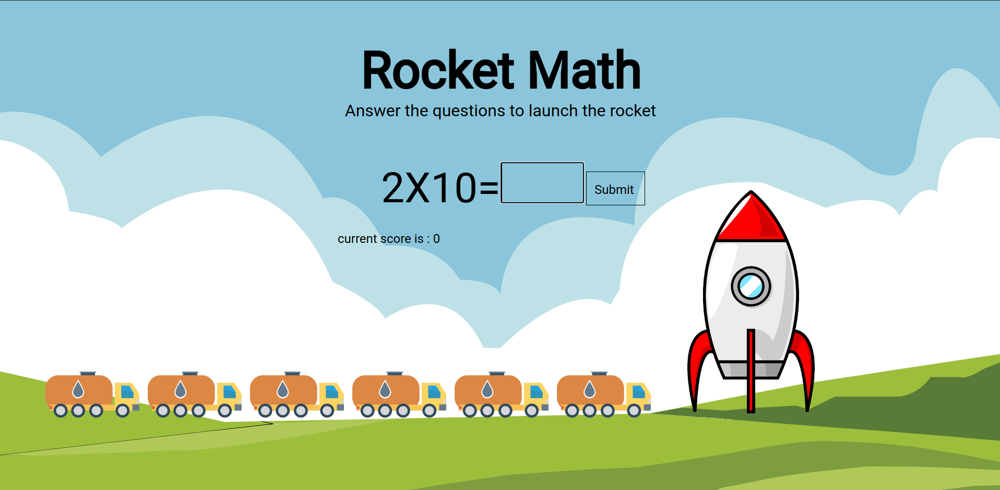
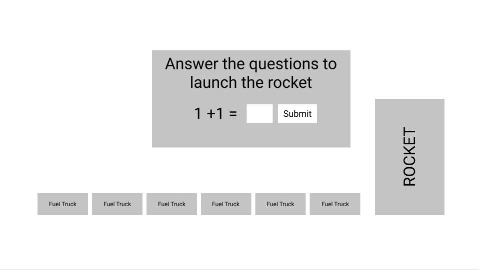
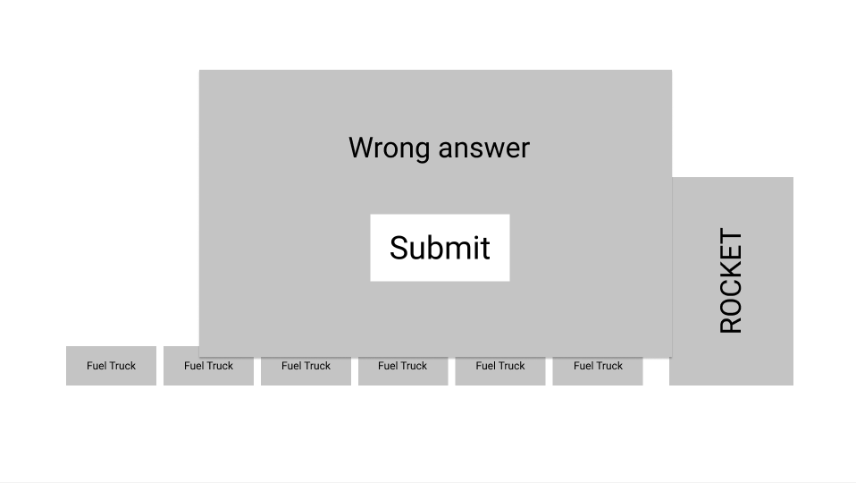

# Maths Quiz 

---
 In the Project I will create a Maths game in HTML, JavaScript and CSS, the quiz game will randomly generate addition subtraction and multiplication problems, Then game for the player to solve.The game is based on the idea of fueling the rocket. The player will have to answer 6 questions, each question will add fuel to the rocket, once the rocket is fueled it will launch.

---

 ## ShowCase

---

---

 ## Navigation

---
* [UX](#User-Experience)
* [User-stories](#user-stories)
* [Structure](#structure)
* [Features](#Design-and-Features)
* [Technologies](#technologies)
* [Testing](#testing)
* [Deployment](#deployment)
* [Credits](#credits)
* [Media](#media)

---

### User Experience 

---

This Project is designed for anyone looking to enjoy a maths based game, the User Experience is designed to be accessible to all users, with a plan simple UI to compliment it.

---

### User Stories

---

As a player I want to be able to experience a maths game so I can enjoy it.

As a player I want to be able to easily understand how to play so that I can quickly play the game.

As a site owner I want to challenge players to gain play a maths game and win.

As a site owner I want to provide a challenge for players

---

## Structure

---
This project will be a single page website with user UX and UI being controlled through CSS and JavaScript.

---

## Design and Features

---
WireFrames documenting the Design process

The design has on purposely been left clean and simple, with a single page design, the art style selected is a cartoon art style

---

## Technologies Used

---

### Languages

- [HTML](https://en.wikipedia.org/wiki/HTML)
- [CSS](https://en.wikipedia.org/wiki/CSS)
- [JavaScript](https://en.wikipedia.org/wiki/JavaScript)
  
### Frameworks, Libraries and Resource

- Google Dev tools: for testing.
- Lighthouse: for performance and accessability tests
- Prettier: to beautify code
- W3C HTML-validator: Used to find mistakes in my html code.  
- Jigsaw: Used to find mistakes in my CSS code.
- Figma: Used to design the wireframe.
- Visual studio code: used to write the code.

---

## Testing

---

My plan for testing this site is fairly simple, Once everything is in place  intend on checking the functionality of the site by playing through the game and testing for any issues, This testing will include the buttons, images  and text to make sure they all have consistent behavior and behavior that falls inline with my user stories.

After this I will pass the project code through the W3C validator and lighthouse in the google dev tools. I will then fix any issues and suggestions these tools present.

---

## Deployment

---

My Project will be deployed using github pages, I will Log in to git hub and access repository for the MileStone Project, from there I will access the settings for the repository and head down to the pages section section and deploy it from there, Once Deployed the site will be available [HERE](https://continuum-web.github.io/MS2-Math-Quiz/)

---

## Credits
---
I would like to thank my mentor tonija Simic for help and advice around the project, and for links to information to improve my code.

I would also like to acknoledge the use of google and Stack OverFlow when I needed to remember functions methods.

---
## Media
---
The following are links to any media I have used:

[Fuel Truck](https://www.pngwing.com/en/free-png-svski/) credit to pngwing for the image

[Background](https://pixabay.com/vectors/field-sky-hill-landscape-nature-5405232) credit to Pixabay and Radoan_tanvir for the image

[Rocket](http://clipart-library.com/clipart/rocket-cliparts_9.htm) credit to clipart-Library for the use of the image

---

